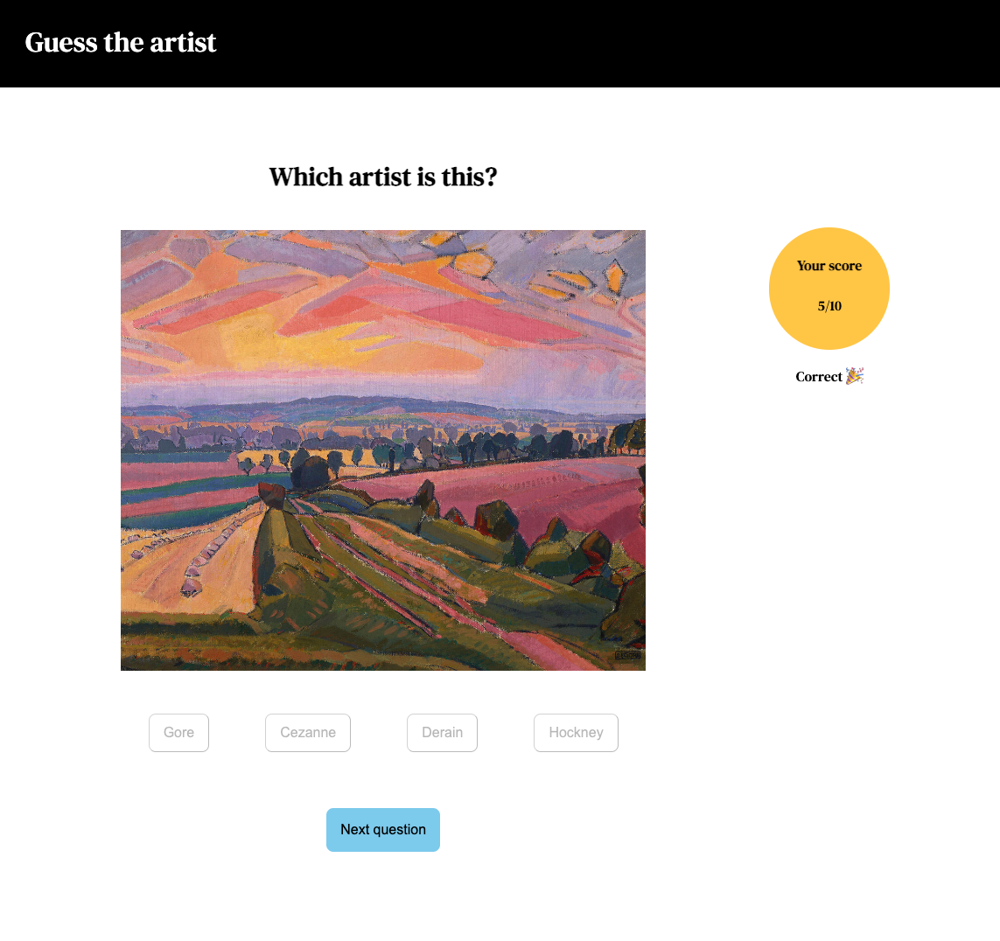
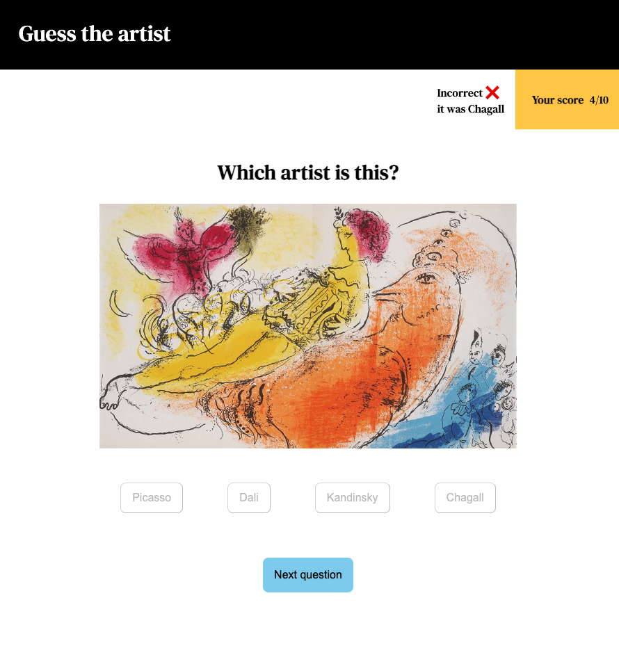
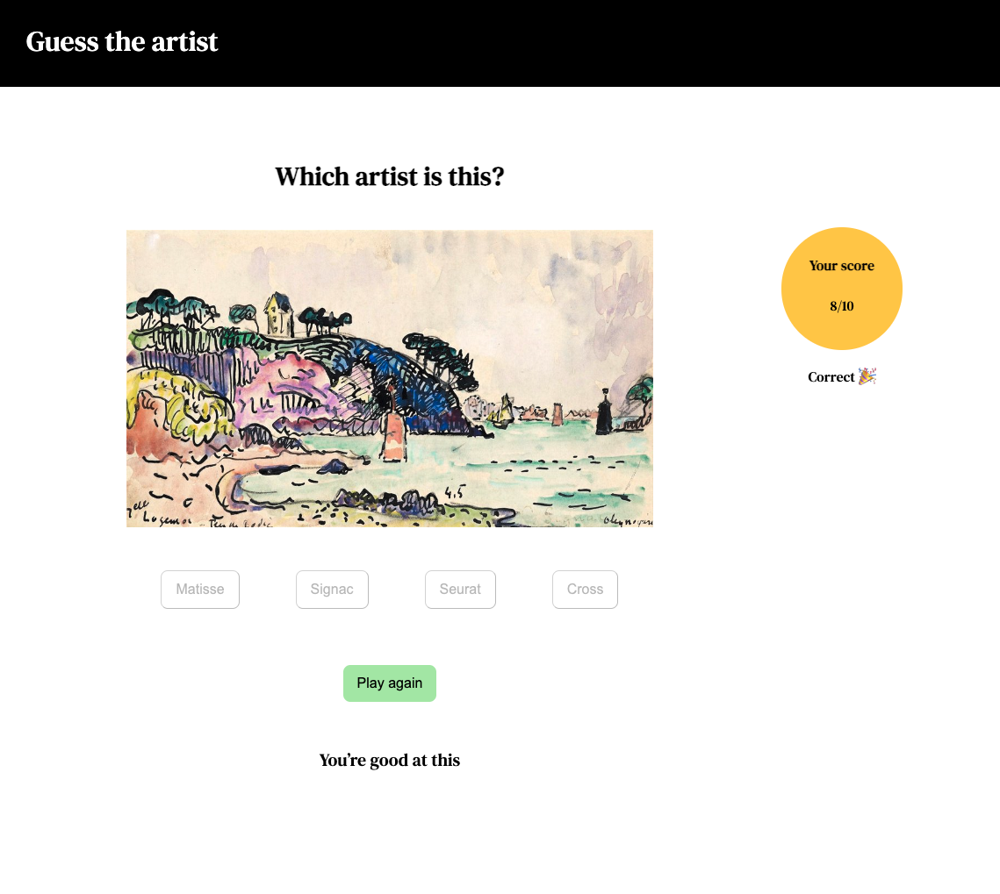
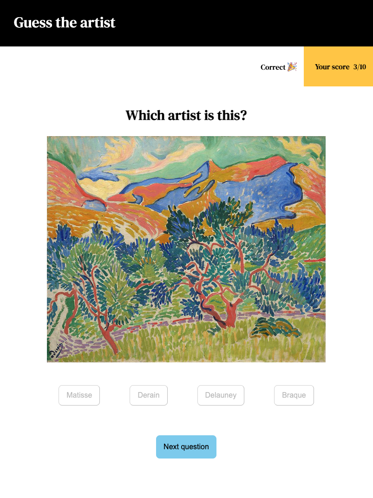
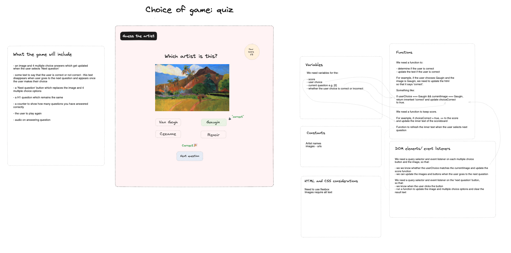

# Guess the artist

## Background

Play [Guess the artist](https://emmafrith.github.io/guess-the-artist/ "Guess the artist") to test your art knowledge. 

I built this quiz as I enjoy art and identifying art based on its style.

## Features

The game features 10 paintings, each with 4 multiple choice answers. 

After selecting a choice, there is:

* a 'correct' or 'incorrect' message
* a different sound depending on whether you're correct or not 

You can only guess once for each question.

Your score will go up by one with each correct answer. 

At the end of the game you'll recieve a personalised message based on how many answers you got correct. 

## Screenshots

Screenshot showing a correct result.

Screenshot showing an incorrect result on a smaller screen such as an iPad.

Screenshot showing the end of the game when you got more than 6 correct answers. 

Screenshot showing the responsive design. 

## Technologies used

This game is built using HTML, CSS and Javascript. 

The game is responsive for use on different devices. 

## Planning materials

I used Excalidraw to design and pseudocode this game. 

## Attributions

The images are taken from the following websites:

* WikiArt
* Art UK
* The Art Story
* The National Gallery of Art
* The Bookroom Art Press
* Christies
* Park West Gallery
* Wikepedia 

## Future enhancements

This MVP can be enhanced by adding more paintings and randomising the paintings shown each time you play. 

It could also feature more themes, such as 'Guess the movemenent'. 

The design also needs improvement as there is some movement when navigating between questions. 
